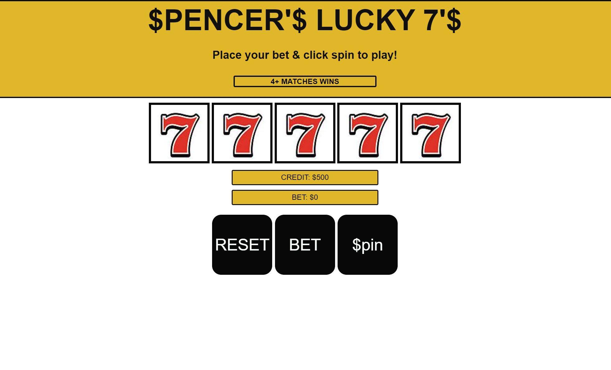
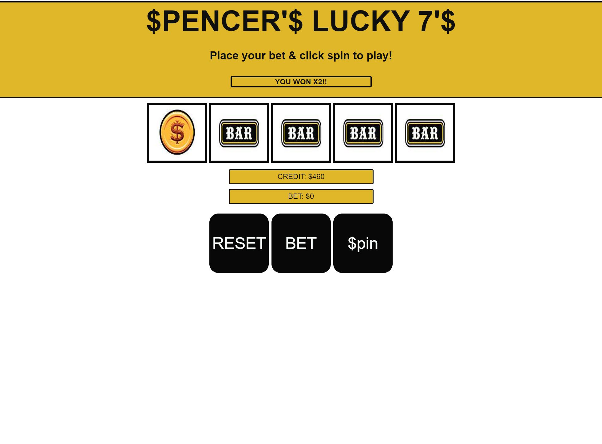
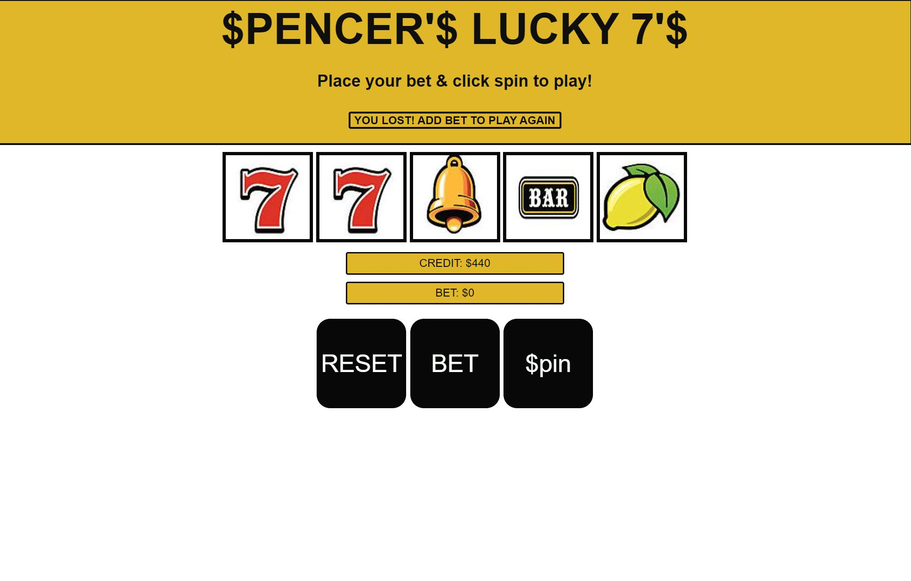
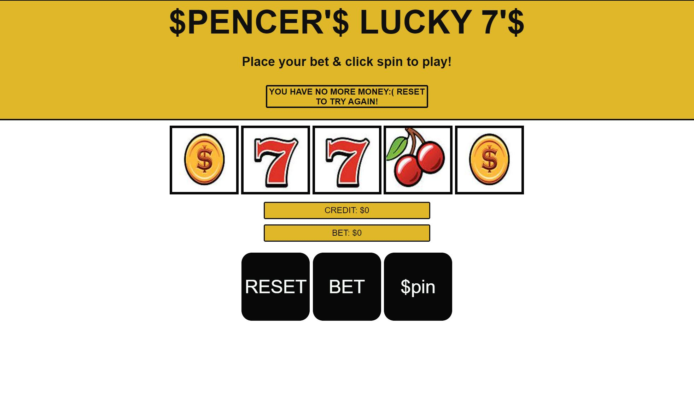

# $PENCER'$ LUCKY 7'$

Welcome to my virtual slot machine! This slot machine is a virtual take on the classic slot machine using classic slot machine symbols. It has 5 slots and 6 symbols that are randomly generated each spin. 4 matches to win!

My goal? To steal all your money! [Click the link](https://spencerbrake.github.io/Slot-Machine-Browser-Game-/) to test your luck on my slot machine!

## Wireframe

## Technologies Used:

- HTML
- CSS
- Javascript

## GETTING STARTED

1. Click the [link](https://spencerbrake.github.io/Slot-Machine-Browser-Game-/) to open game in browser.
2. Click BET to add your bet. Bet increases by $20 on each click and substracts from credit. Can bet as much as you want up to $500.
3. Once bet is placed, click $pin to see your results.
4. If you win, your bet doubles and gets added to  your credit. Each spin will reset bet amount.
 5. Keep playing till your out of money or hit reset to start over!
6. HAVE FUN!

## NEXT STEPS:
1. Would like to make the slots spin with symbols when spin button is pressed 
2. add sounds to the buttons when clicked 
3. make the page prettier. maybe add background image for white space.
4. open to suggestions 